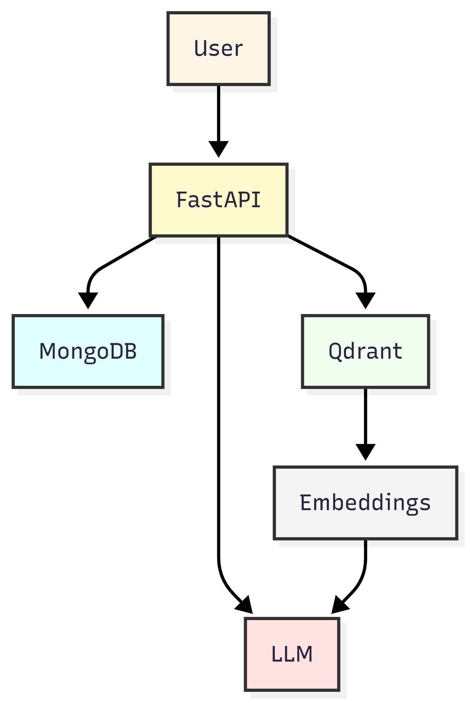
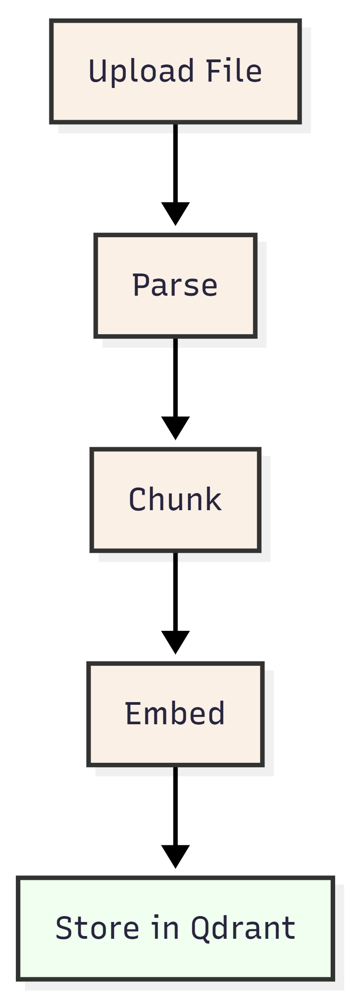
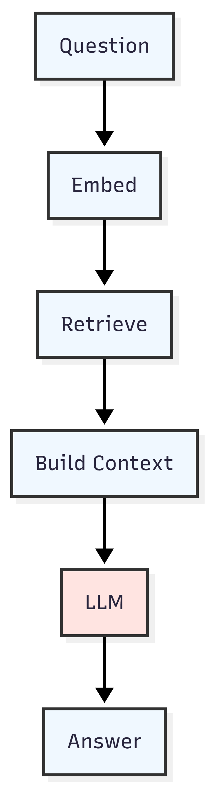

# Báo cáo Dự án ChatML

- **Thời gian cập nhật:** 14/06/2026
- **Người thực hiện:** Antigravity AI
- **Dự án:** ChatML (Document Ingestion & RAG Retrieval Service)

---

## I. Tổng quan dự án
ChatML là một dự án chatbot hỗ trợ học tập Machine Learning. Hệ thống được thiết kế dưới dạng dịch vụ backend sử dụng mô hình RAG (Retrieval-Augmented Generation), cho phép người dùng nạp các giáo trình, tài liệu học tập Machine Learning (`.pdf`, `.docx`, `.txt`, `.md`) vào hệ thống để chatbot học hỏi và trả lời các câu hỏi thắc mắc dựa trên nội dung chính xác của những tài liệu này.

---

## II. Công nghệ sử dụng (Tech Stack)
Hệ thống được tích hợp các công nghệ hiện đại phục vụ cho RAG và AI Chatbot:
1. **Framework chính:** **FastAPI** - Framework web Python bất đồng bộ hiệu năng cao dùng để xây dựng các RESTful API nhanh chóng và trực quan.
2. **Cơ sở dữ liệu Metadata:** **MongoDB** - Lưu trữ và quản lý metadata của tài liệu học tập tải lên.
3. **Cơ sở dữ liệu Vector:** **Qdrant Vector Database** - Lưu trữ các đoạn văn bản học tập đã được nhúng vector và thực hiện tìm kiếm tương đồng (Similarity Search) dựa trên khoảng cách Cosine.
4. **Trích xuất văn bản (Parsing):** `unstructured` - Trích xuất văn bản thô từ nhiều định dạng file tài liệu khác nhau.
5. **Phân đoạn văn bản (Chunking):** **LangChain** - Sử dụng `RecursiveCharacterTextSplitter` giúp chia tài liệu thành các khối văn bản (chunks) nhỏ có độ dài tối ưu và chồng lấp (overlap) hợp lý để bảo toàn ngữ cảnh.
6. **Vector Embeddings:** `sentence-transformers` - Chạy mô hình nhúng cục bộ `BAAI/bge-small-en-v1.5` để chuyển đổi các đoạn văn bản thành vector 384 chiều.
7. **Mô hình ngôn ngữ lớn (LLM):** **Gemini API (Google GenAI)** - Mô hình tạo câu trả lời tự nhiên cho chatbot dựa trên ngữ cảnh được trích xuất từ tài liệu học tập.
8. **Kiểm thử tự động:** `pytest` - Framework chạy unit tests, kiểm thử chức năng ngoại tuyến thông qua mocking.
9. **Đóng gói dịch vụ:** **Docker & Docker Compose** - Container hóa và chạy các dịch vụ cơ sở dữ liệu độc lập (MongoDB, Qdrant).

---

## III. Cấu trúc và chức năng các thư mục dự án
Dự án được phân chia theo cấu trúc modular rõ ràng giúp dễ bảo trì và mở rộng:
- **`app/`**: Thư mục mã nguồn chính của ứng dụng.
  - **`app/api/`**: Định nghĩa các router FastAPI và các endpoint giao tiếp với client.
    - `document.py`: Quản lý tài liệu (tải lên, cập nhật, lấy thông tin, xóa, tìm kiếm tương đồng).
    - `chat.py`: Cung cấp endpoint chatbot hỏi đáp (`/chat/chat`).
  - **`app/core/`**: Quản lý cấu hình toàn cục (`settings`, port, mô hình sử dụng) và biến môi trường.
  - **`app/database/`**: Khởi tạo client kết nối tới MongoDB (`mongodb.py`) và Qdrant (`qdrant.py`).
  - **`app/models/`**: Định nghĩa các Pydantic schemas/models cho dữ liệu truyền nhận qua API (`Document`, `Chunk`, `ChatResponse`, v.v.).
  - **`app/repositories/`**: Lớp thao tác trực tiếp với cơ sở dữ liệu (MongoDB và Qdrant) nhằm cô lập mã nguồn nghiệp vụ với hệ quản trị CSDL cụ thể.
  - **`app/services/`**: Chứa logic nghiệp vụ cốt lõi:
    - `parsing_service.py`: Trích xuất nội dung văn bản từ file.
    - `chunking_service.py`: Cắt nhỏ tài liệu học tập thành từng khối.
    - `embedding_service.py`: Chuyển đổi khối văn bản thành vector nhúng.
    - `ingestion_service.py`: Quản lý quy trình nạp tài liệu tổng thể (`parse` -> `chunk` -> `embed` -> lưu trữ).
    - `retrieval_service.py`: Tìm kiếm thông tin tương tự câu hỏi trên cơ sở dữ liệu vector Qdrant.
    - `chat_service.py`: Tổng hợp ngữ cảnh từ retrieval, kết hợp prompt mẫu và gọi LLM tạo câu trả lời.
    - `llm_service.py`: Kết nối và gọi API Gemini.
  - **`app/storage/`**: Quản lý việc đọc/ghi và xóa các tệp tài liệu học tập vật lý cục bộ.
  - **`app/main.py`**: File khởi chạy chính của ứng dụng FastAPI.
- **`data/`**: Thư mục lưu trữ vật lý các file tài liệu học tập đã tải lên hệ thống.
- **`docs/`**: Chứa các sơ đồ kiến trúc và tài liệu đặc tả dự án.
- **`reports/`**: Thư mục chứa các báo cáo hoạt động dự án (bao gồm báo cáo này).
- **`tests/`**: Chứa toàn bộ kịch bản kiểm thử tự động (Unit tests) giả lập các database và API kết nối để kiểm tra logic.
- **`.env`**: Lưu trữ cấu hình biến môi trường của hệ thống.
- **`docker-compose.yml`**: File cấu hình chạy cơ sở dữ liệu MongoDB và Qdrant thông qua Docker.
- **`requirements.txt`**: Danh sách thư viện Python phụ thuộc phục vụ dự án.

---

## IV. Vòng đời của dữ liệu (Data Lifecycle)
Trong dự án ChatML, dữ liệu tài liệu học tập Machine Learning trải qua vòng đời đầy đủ bao gồm các giai đoạn: Khởi tạo (Create), Sử dụng (Used), Cập nhật (Update), và Xóa (Delete).

### 1. Giai đoạn CREATE (Khởi tạo dữ liệu)
- **Trình kích hoạt:** Người dùng gửi tệp tài liệu thông qua phương thức POST tới `/document/upload-document`.
- **Lưu trữ Vật lý:** Tệp gốc được lưu trữ cục bộ trên máy chủ trong thư mục dữ liệu `data/` với tên tệp là ID duy nhất dạng UUID.
- **Cơ sở dữ liệu Metadata (MongoDB):** Bản ghi thông tin tài liệu được tạo mới, lưu trữ các trường:
  - `_id`: ID tài liệu tự sinh (UUID).
  - `filename`, `file_type`, `file_size_byte`: Thông tin cơ bản của tệp.
  - `version`: Phiên bản khởi tạo (mặc định = 1).
  - `status`: Trạng thái ban đầu (`"uploaded"`).
  - `created_at`, `updated_at`: Thời gian khởi tạo/cập nhật.
  - `storage`: Đường dẫn lưu trữ vật lý local.
- **Cơ sở dữ liệu Vector (Qdrant):** 
  - Văn bản trong tệp được trích xuất thành chuỗi văn bản thuần túy.
  - Văn bản được cắt nhỏ thành các đoạn (chunks). Mỗi đoạn được gán một UUID (`chunk_id`) và chỉ số index.
  - Mỗi đoạn được tính toán vector embedding (kích thước 384 chiều).
  - Các điểm vector (Points) được ghi vào Qdrant với ID là `chunk_id`, vector nhúng, cùng payload chứa: `document_id`, `dataset_id`, `chunk_id`, `chunk_index`, `chunk_text`, `source` (tên tệp), `version` và tên mô hình nhúng.

### 2. Giai đoạn USED (Sử dụng dữ liệu)
- **Đọc thông tin:** 
  - Xem danh sách tài liệu đang có bằng GET `/document/get-list-document` (đọc từ MongoDB).
  - Xem chi tiết metadata của một tài liệu cụ thể bằng GET `/document/get-document/{document_id}` (đọc từ MongoDB).
- **Truy vấn ngữ nghĩa (Semantic Search):**
  - Truy cập thông qua GET `/document/retrieval`. Nhận câu hỏi học tập, mã hóa câu hỏi thành vector, thực hiện tìm kiếm tương đồng trên Qdrant để trả về các đoạn văn bản Machine Learning có độ tương đồng cao nhất kèm payload.
- **Hỏi đáp tích hợp LLM (RAG Chat):**
  - Truy cập qua POST `/chat/chat`. Hệ thống gọi dịch vụ tìm kiếm ngữ nghĩa Qdrant để lấy các đoạn văn bản chứa thông tin cần tìm, ghép các đoạn này lại làm ngữ cảnh (context), kết hợp câu hỏi học tập để tạo Prompt hoàn chỉnh gửi tới Gemini API. Phản hồi trả về gồm câu trả lời giải thích kiến thức và thông tin nguồn tham khảo trích từ payload của các điểm vector Qdrant.

### 3. Giai đoạn UPDATE (Cập nhật dữ liệu)
- **Trình kích hoạt:** Người dùng gửi tệp tài liệu mới thay thế thông qua POST tới `/document/update-document/{document_id}`.
- **Xử lý tệp:** Thay thế tệp vật lý cũ trong thư mục `data/` bằng tệp mới.
- **Cập nhật Metadata (MongoDB):**
  - Tăng giá trị phiên bản `version` lên +1.
  - Cập nhật các trường: `filename`, `file_type`, `file_size_byte`, `updated_at`.
  - Đổi trạng thái `status` thành `"updated"`.
- **Đồng bộ hóa Qdrant Vector DB:**
  - Tìm kiếm và xóa tất cả các điểm vector (points) hiện tại trong Qdrant có chứa `document_id` tương ứng để dọn dẹp các chunk cũ của tài liệu này.
  - Tiến hành trích xuất văn bản từ tệp mới, chia nhỏ, nhúng vector và đẩy toàn bộ các vector chunks mới này lên Qdrant với phiên bản `version` mới cập nhật.

### 4. Giai đoạn DELETE (Xóa dữ liệu)
- **Trình kích hoạt:** Người dùng gọi phương thức DELETE tới `/document/delete-document/{document_id}`.
- **Xóa Vật lý:** Tệp tài liệu tương ứng lưu trữ trong thư mục `data/` bị xóa hoàn toàn khỏi đĩa cứng.
- **Xóa Metadata (MongoDB):** Bản ghi metadata chứa `_id` tương ứng với `document_id` bị xóa sạch khỏi MongoDB.
- **Xóa Vector (Qdrant):** Gửi lệnh xóa toàn bộ các điểm vector (points) trong collection Qdrant có điều kiện lọc payload `document_id` bằng ID tài liệu bị xóa.
- **Đảm bảo tính nhất quán:** Hệ thống được thiết lập cơ chế xử lý lỗi ngoại lệ (exception handling) để ngay cả khi tệp vật lý bị xóa thủ công trước đó, bản ghi trong MongoDB và vector trên Qdrant vẫn được dọn sạch hoàn toàn khi gọi API.

---

## V. Sơ đồ hoạt động và luồng dữ liệu (System Flows)
Để minh họa trực quan cách thức hoạt động của hệ thống, dưới đây là các sơ đồ luồng chính nằm trong thư mục `docs/`:

### 1. Sơ đồ tổng quan hệ thống (Overall System Flow)
Sơ đồ này mô tả cấu trúc tổng thể và các kết nối giữa các thực thể: Người dùng, API Gateway (FastAPI), cơ sở dữ liệu MongoDB (metadata), Qdrant Vector DB (vector chunks) và LLM Service (Gemini API) để tạo nên hệ thống chatbot hỗ trợ học tập Machine Learning.

### 2. Sơ đồ luồng nạp dữ liệu (Ingestion Flow)
Sơ đồ này chi tiết hóa từng bước xử lý tài liệu khi được đưa vào hệ thống: Tải lên -> Trích xuất văn bản thô -> Chia nhỏ đoạn (chunking) -> Tạo vector nhúng -> Lưu trữ vector và metadata vào cơ sở dữ liệu.

### 3. Sơ đồ luồng trò chuyện hỏi đáp (Chat Flow)
Sơ đồ này mô tả quy trình tiếp nhận câu hỏi của học viên, mã hóa câu hỏi thành vector, thực hiện tìm kiếm tương đồng trên Qdrant để trích xuất các đoạn tài liệu Machine Learning phù hợp nhất, xây dựng ngữ cảnh và chuyển tới Gemini LLM sinh câu trả lời chính xác nhất.

---

## VI. Đánh giá và định hướng tiếp theo
- Hệ thống hiện tại hoạt động rất ổn định với đầy đủ luồng nghiệp vụ RAG hỗ trợ học tập Machine Learning từ khâu nhập giáo trình đến khâu hỏi đáp thông minh.
- Bộ unit test hỗ trợ tốt cho việc phát triển và bảo trì liên tục.
- **Kế hoạch tiếp theo:** Nghiên cứu cải tiến kỹ thuật tìm kiếm (ví dụ: Hybrid Search kết hợp Keyword Search và Vector Search, tích hợp Re-ranking để nâng cao độ chính xác của ngữ cảnh trước khi đưa vào LLM).
