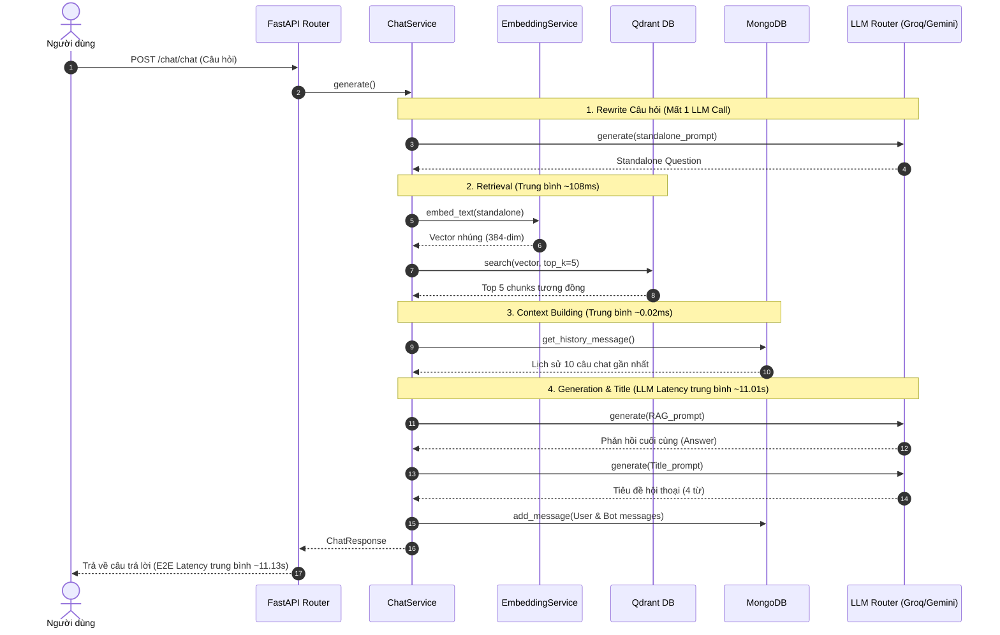

# Báo cáo Dự án ChatML — Báo cáo Tiến độ & Kết quả Benchmark (report_1)

- **Thời gian cập nhật:** 20/06/2026
- **Người thực hiện:** Antigravity AI
- **Dự án:** ChatML (Document Ingestion & RAG Retrieval Service)

---

## Phần 1: Cập nhật Tiến độ Phát triển (Từ Thứ Hai đến Hôm Nay)

Trong tuần qua (từ thứ Hai 15/06/2026 đến hôm nay thứ Bảy 20/06/2026), dự án ChatML đã trải qua những cải tiến lớn về cả giao diện người dùng (Frontend), quản lý phiên hội thoại (Database) và tối ưu hóa truy vấn RAG (Core Backend), kết thúc bằng việc tích hợp hệ thống đánh giá hiệu năng (Benchmark).

### Sơ đồ Lộ trình Phát triển Tuần qua (15/06 - 20/06)

```mermaid
gantt
    title Lộ trình phát triển tuần (15/06 - 20/06/2026)
    dateFormat  YYYY-MM-DD
    axisFormat %d/%m
    section Frontend & Storage
    Giao diện Chat UI & MongoDB Schema          
    Sidebar hiển thị danh sách hội thoại       
    section RAG Core Backend
    Phát triển ContextBuilderService            
    Tích hợp Rewrite Query (Standalone Q)       
    section Benchmark System
    Xây dựng Framework Benchmark & Dataset      
    Đo lường & Phân tích Latency   
```

---

## Phần 2: Kết quả Đánh giá Hiệu năng (Benchmark Results)

Hệ thống đánh giá benchmark toàn diện đã được triển khai trên tập dữ liệu gồm **100 câu hỏi** đã qua sàng lọc thủ công . Kết quả chi tiết của từng thành phần RAG như sau:

### 1. Phân tích Luồng Dữ liệu & Độ trễ (RAG Latency Pipeline)

Sơ đồ tuần tự dưới đây biểu diễn chi tiết thời gian xử lý của từng thành phần trong pipeline RAG, được đo lường thực tế trên **30 câu hỏi đại diện** (Task 8):



### 2. Bảng chỉ số đo lường chi tiết (Benchmark Metrics)

Dưới đây là các chỉ số chi tiết được ghi nhận từ hệ thống đánh giá:

| Nhóm Đánh Giá | Chỉ số (Metric) | Giá trị ghi nhận | Ý nghĩa & Phân tích |
| :--- | :--- | :--- | :--- |
| **Truy xuất dữ liệu (Retrieval)** | **Recall@5** | **88.00%** | Tỷ lệ tìm thấy các chunks tài liệu thực tế chứa câu trả lời đúng nằm trong Top 5 kết quả tìm kiếm. |
| | **Hit Rate@5** | **88.00%** | Xác suất tìm thấy ít nhất 1 chunk tài liệu liên quan trong Top 5. |
| | **MRR (Mean Reciprocal Rank)** | **0.7715** | Điểm số thứ hạng của chunk liên quan (càng gần 1 thì chunk đúng càng nằm ở vị trí đầu tiên). |
| **Nội dung câu trả lời (Generation)** | **Average Correctness** | **4.16 / 5.0** | Điểm đánh giá chất lượng câu trả lời bằng LLM-as-Judge (4 = Hầu hết chính xác, 5 = Hoàn toàn chính xác). |
| | **Score Distribution** | 1: **2** \| 2: **2** \| 3: **3** \| 4: **64** \| 5: **29** | Phân phối điểm số độ chính xác (phần lớn tập trung ở điểm 4 và 5). |
| **Độ trung thực (Faithfulness)** | **Average Faithfulness** | **4.18 / 5.0** | Mức độ trung thực của câu trả lời so với ngữ cảnh (không tự ý bịa đặt thông tin). |
| | **Hallucination Rate** | **7.00%** | Tỷ lệ xảy ra hiện tượng ảo giác (câu trả lời có chứa thông tin không có trong tài liệu). |
| **Độ trễ hệ thống (Latency)** | **E2E Mean (Trung bình)** | **11.13s** | Thời gian phản hồi trung bình của người dùng cho một câu hỏi. |
| | **E2E Median (Trung vị)** | **11.62s** | Thời gian phản hồi trung vị. |
| | **E2E P95** | **21.99s** | Độ trễ ở phân vị 95 (bị ảnh hưởng lớn bởi giới hạn API Rate Limit của Groq và thời gian chờ retry). |

### 3. Phân tích Độ trễ từng thành phần (Latency Breakdowns)

```mermaid
barChart
    title Phân bổ thời gian xử lý trung bình (giây)
    xlabel "Thành phần hệ thống"
    ylabel "Độ trễ trung bình (s)"
    "Tìm kiếm tương đồng (Retrieval)": 0.108
    "Xây dựng ngữ cảnh (Context)": 0.00002
    "Thời gian xử lý LLM (LLM Calls)": 11.010
    "Thời gian phản hồi tổng (E2E)": 11.129
```

